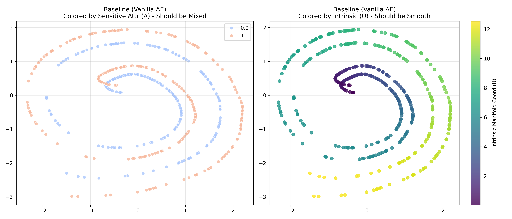
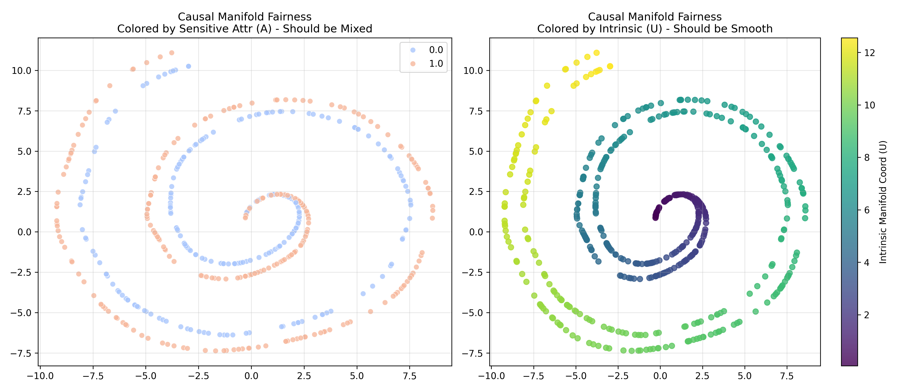

# Causal Manifold Fairness (CMF): Enforcing Geometric Invariance in Representation Learning


This repository contains the official PyTorch implementation of **Causal Manifold Fairness (CMF)**. 

CMF is a novel framework that approaches fairness through the lens of **Riemannian Geometry**. Instead of simply aligning data points in a latent space, CMF enforces that the **geometry** (the local metric and curvature) of the learned representation remains invariant under counterfactual interventions on sensitive attributes.

---

## The Problem & Motivation

Standard fairness methods often treat data as static points. However, sensitive attributes (like Age or Gender) often act as parameters that **warp** the manifold of the data—stretching, compressing, or twisting the relationship between features.

**The Goal:** Learn a representation $z$ where the mapping to the observation space $X$ preserves the same "rules of geometry" (distances and shapes) regardless of the sensitive attribute $A$.

### Visualization
<p align="center">
  
  
</p>

- **Left (Baseline):** The model separates data based on the sensitive attribute $A$ (Red vs Blue). It learns the bias.
- **Right (CMF):** The model aligns the distributions. Crucially, the intrinsic manifold structure (color gradient) is preserved.

---

## Usage

### 1. Installation
Clone the repo and install dependencies:

```bash
git clone https://github.com/your-username/causal-manifold-fairness.git
cd causal-manifold-fairness
pip install torch numpy matplotlib seaborn pandas
```

### 2. Run the Experiment
To train both the Baseline and CMF models, and generate the visualizations/metrics:

```bash
python main.py
```

**Note:** The script calculates second-order derivatives (Hessians) which can be computationally intensive.
